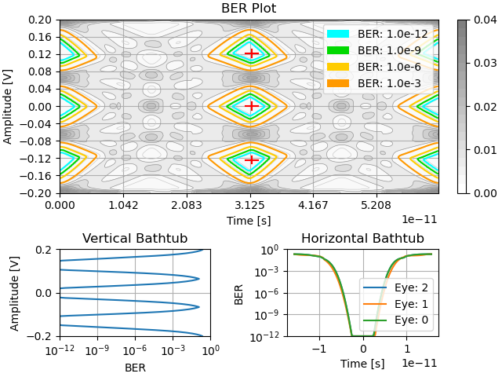

# StatEye Simulation

Statistical eye modelling tool, StatEye, ported to Python 3. Uses statistical methods to model various wireline effects to estimate the performance of different wireline system configurations, provides estimates for Bit Error Rates, Eye dimensions, as well as various plots realting to system performance.

## Features 

- Reading in Touchstone (.s4p) files for channel data
- Simulating and characterizing the performance of different signalling schemes such as PAM-4
- Introducing the effects of cross-talk, noise, and distortion
- Plotting channel and equalizer behaviour curves
- Optimizing equalizers for a given system configuration using a genetic algorithm

## Example Outputs

The following output plots are generated using the configuration in `generateUserSettingsExampleECE1392.py`.

Polots related to the system's characteristics

The pulse response of the system, there are some slight deviations from the MATLAB version due to the different approaches taken to model it. In MATLAB a polynomial was fit to the frequency resonse, however in Python the discrete time response based on frequency response was used with no curve fitting.

Using the pulse response with the different possible data strings to record the different possible inter-symbol interference trajectories for the system, to take.

Plots of the various influences on the system.

The final probability density distribution and analysis.

## Remaining Work

- [x] Fix up and validate the adaption system
- [ ] Perform more varied tests of the system
- [ ] Polish up the figure formatting. E.g. prevent axes labels overlapping adjacent plots when the window is sized smaller.
- [ ] Port more example configurations for users
- [ ] Update and upload documentation for operation based on the "readme"s from MATLAB
- [ ] Clean up comments and disclaimers in files
- [ ] Verify accuracy of system simulation (pulse and CTLE responses)

# Dependancies

In addition to Python 3, the following libraries are needed to run this code:

- [NumPy](https://numpy.org/install/)
- [SciPy](https://scipy.org/install/)
- [matplotlib](https://matplotlib.org/stable/users/getting_started/index.html#installation-quick-start)
- [scikit-rf](https://github.com/scikit-rf/scikit-rf)
- [Python Control Library](https://python-control.readthedocs.io/en/0.9.3.post2/intro.html)

# Credit

Originally written in MATLAB by by Jeremy Cosson-Martin and Jhoan Salinas for Ali Sheikholeslami's research group. Porting to Python was done by Savo Bajic as a projects for Ali Sheikholeslami's wireline course (ECE1392).
